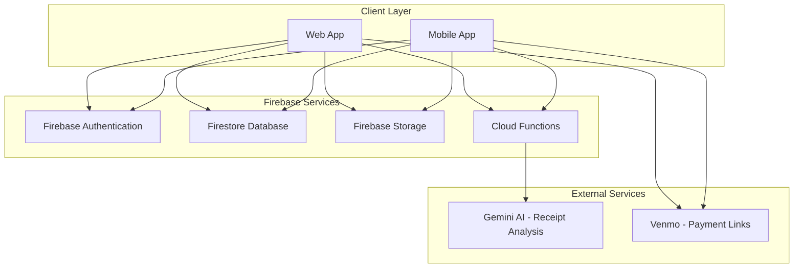
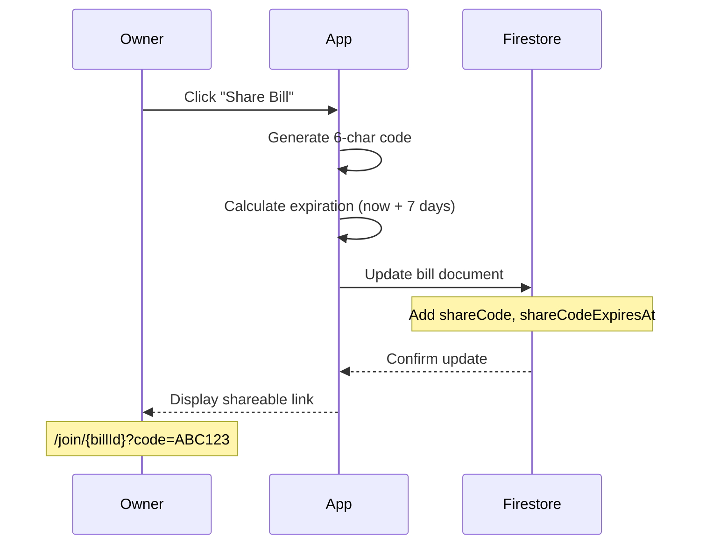
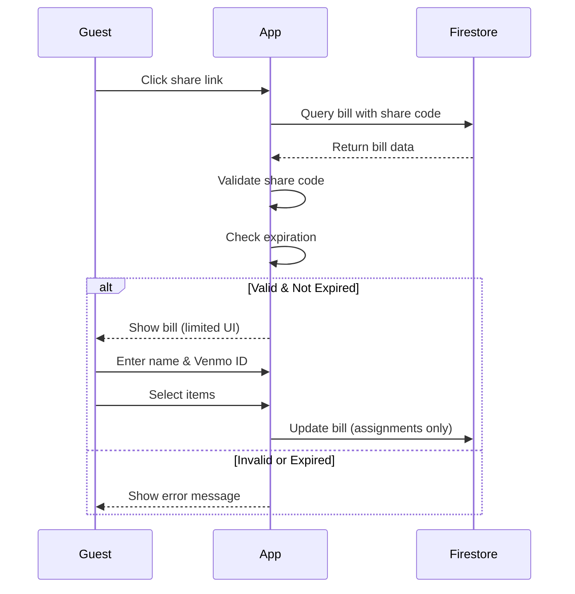

# Storage Architecture System Design

## System Overview

A bill splitting application that allows users to create, share, and manage bills with flexible access control and guest participation.

---

## High-Level Architecture



### Core Components

1. **Client Applications**
   - Web application (React + TypeScript)
   - Mobile application (Capacitor)
   - Real-time synchronization via Firestore listeners

2. **Firebase Backend**
   - **Authentication**: Google OAuth for user login
   - **Firestore**: NoSQL database for bills, users, groups
   - **Storage**: Cloud storage for receipt images
   - **Cloud Functions**: AI receipt analysis, server-side logic

3. **External Integrations**
   - **Gemini AI**: Automated receipt scanning and item extraction
   - **Venmo**: Deep links for payment requests

---

## Data Storage Architecture

### Database: Firestore (NoSQL)

```
firestore/
├── users/{userId}              # User profiles and preferences
├── bills/{billId}              # All bills (private & group)
├── groups/{groupId}            # Group definitions
├── groupInvitations/{inviteId} # Pending group invitations
└── receiptAnalysisCache/{id}   # AI analysis cache (optional)
```

### File Storage: Firebase Storage

```
storage/
└── receipts/
    └── bills/
        ├── {billId}_receipt.jpg
        ├── {billId}_receipt.png
        └── ...
```

---

## Bill Types & Access Control

### 1. Private Bills

**Purpose**: Personal bill splitting where owner manages everything

**Characteristics**:
- Created by authenticated user
- Only owner can access (without share link)
- Owner has full control (create, edit, delete, assign)
- Never expires
- Can generate temporary share links for guest participation

**Workflow**:
1. **Scan/Create Bill**: Upload receipt or manually enter items
2. **Add People**: Owner adds participants via:
   - **Squads**: Pre-saved groups of friends
   - **Friends List**: Saved contacts with Venmo IDs
   - **User Search**: Search for app users by name/email
   - **Manual Entry**: Add name + Venmo ID manually
3. **Assign Items**: Owner assigns items to people (or people assign themselves via share link)
4. **Venmo Screen**: Generate Venmo payment requests for each person
   - Shows itemized breakdown per person
   - Creates Venmo deep links with amounts
   - **No payment tracking** - just generates requests

**Access Control**:
- **Owner**: Full access (read, write, delete, assign anyone)
- **Others**: No access (unless via share link)

**Use Cases**:
- Splitting dinner bill with friends
- Roommate expense reimbursement
- Group outing expenses

---

### 2. Group Bills

**Purpose**: Shared expenses within a defined group of users

**Characteristics**:
- Created within a group context
- All group members can access
- All members have equal permissions
- Never expires
- Any member can generate share links

**Access Control**:
- **Group Members**: Full access (read, write)
- **Group Owner**: Can delete group (which archives all bills)
- **Non-Members**: No access (unless via share link)

**Use Cases**:
- Roommate expenses
- Club/organization bills
- Regular group activities

---

### 3. Share Links (Temporary Guest Access)

**Purpose**: Allow non-authenticated users to participate in bill splitting

**Characteristics**:
- Can be created for ANY bill (private or group)
- Expires after 7 days
- Can be regenerated unlimited times
- Provides limited access to guests

**Who Can Create Share Links**:
- **Private Bills**: Owner only
- **Group Bills**: Any group member

**Share Link Lifecycle**:
1. Owner/member generates share link → creates 6-character code
2. Link is active for 7 days
3. After expiration, guests lose access
4. Bill remains intact, can generate new link

---

## Guest Access Permissions

### What Guests CAN Do ✅

When accessing a bill via share link, guests can:

1. **View Bill Details**
   - See all items and prices
   - View subtotal, tax, tip, total
   - See who else is participating

2. **Add Themselves**
   - Enter their name
   - Add their Venmo ID (optional)
   - Join the people list

3. **Assign Themselves to Items**
   - Select which items they're paying for
   - Unselect items they're not paying for
   - See their calculated total

4. **See Real-Time Updates**
   - Changes made by others appear instantly
   - Live synchronization with all participants

### What Guests CANNOT Do ❌

Guests are restricted from:

1. **Modifying Bill Structure**
   - Cannot add new items
   - Cannot edit item names or prices
   - Cannot delete items
   - Cannot modify tax or tip amounts

2. **Managing Others**
   - Cannot assign other people to items
   - Cannot remove other people from the bill
   - Cannot edit other people's information

3. **Administrative Actions**
   - Cannot generate new share links
   - Cannot delete the bill
   - Cannot change bill settings
   - Cannot archive the bill

4. **Creating Bills**
   - Must authenticate to create their own bills
   - Can only join existing bills as guest

---

## Authenticated User Permissions

### Authenticated Users Joining via Share Link ✅

When an authenticated user joins via share link, they get:

- **Full Access**: Same permissions as owner/group members
- **Persistent Access**: Access continues even after share link expires
- **Can Edit Everything**: Items, assignments, tax, tip
- **Can Manage Others**: Assign anyone to any item

**Rationale**: Authenticated users are trusted, guests are not.

---

## Data Structure

### User Document

```
users/{userId}
├── uid: string                 # Firebase Auth UID
├── email: string               # User's email
├── displayName: string         # Display name
├── photoURL: string            # Profile photo
├── venmoId: string             # Venmo username (optional)
│
├── friends: Array              # Saved friends list
│   └── { name, venmoId }       # Quick access for adding to bills
│
├── squads: Array               # Pre-saved groups of friends
│   └── {                       # For frequently used groups
│       name: string,           # e.g., "Roommates", "Work Friends"
│       members: Array          # Array of friend objects
│         └── { name, venmoId }
│   }
│
├── createdAt: timestamp
└── lastLoginAt: timestamp
```

**Purpose**:
- **Friends**: Individual contacts saved for quick access
- **Squads**: Pre-defined groups for recurring bill splits
  - Example: "Roommates" squad with 3 people
  - One-click add entire squad to a bill
  - Faster than adding people individually

**Note**: No payment tracking or history stored

---

### Bill Document

```
bills/{billId}
├── id: string                  # Auto-generated ID
├── billType: enum              # 'private' | 'group'
├── ownerId: string             # Creator's user ID
├── groupId: string             # If billType === 'group'
│
├── billData: object            # Bill details
│   ├── items: Array
│   │   └── { id, name, price }
│   ├── subtotal: number
│   ├── tax: number
│   ├── tip: number
│   ├── total: number
│   └── restaurantName: string
│
├── itemAssignments: object     # Who's paying for what
│   └── {itemId}: [personIds]
│
├── people: Array               # Participants
│   └── { id, name, venmoId }
│
├── customTip: string           # User-entered tip Check if it's needed or not. Dont need it twice.
├── customTax: string           # User-entered tax Check if it's needed or not. Dont need it twice.
├── assignmentMode: enum        # 'checkboxes' | 'percentage' why do we need percentage?
├── splitEvenly: boolean        # Equal split toggle
│
├── receiptImageUrl: string     # Firebase Storage URL
├── receiptFileName: string     # Original filename
│
├── shareCode: string           # 6-char code (optional)
├── shareCodeCreatedAt: timestamp
├── shareCodeExpiresAt: timestamp  # 7 days from creation
├── shareCodeCreatedBy: string  # User ID
│
├── members: Array              # Participation history
│   └── { userId, name, email, joinedAt, isAnonymous }
│
├── createdAt: timestamp
├── updatedAt: timestamp
├── lastActivity: timestamp
└── status: enum                # 'active' | 'archived'
```

---

### Group Document

```
groups/{groupId}
├── id: string                  # Auto-generated ID
├── name: string                # Group name
├── description: string         # Optional description
├── ownerId: string             # Creator's user ID
├── memberIds: Array<string>    # Array of user IDs
├── pendingInvites: Array<string>  # Email addresses
├── createdAt: timestamp
└── updatedAt: timestamp
```

---

### Group Invitation Document

```
groupInvitations/{invitationId}
├── id: string                  # Auto-generated ID
├── groupId: string             # Group being invited to
├── email: string               # Invitee's email
├── invitedBy: string           # User ID who sent invite
├── status: enum                # 'pending' | 'accepted' | 'declined'
├── createdAt: timestamp
└── respondedAt: timestamp
```

---

## Share Link Flow

### Creating a Share Link



### Guest Joining via Share Link



---

## Security Model

### Access Control Rules

| Resource | Owner | Group Member | Guest (Share Link) | Public |
|----------|-------|--------------|-------------------|--------|
| **Private Bill** | Full | None | Read + Self-Assign | None |
| **Group Bill** | Full | Full | Read + Self-Assign | None |
| **User Profile** | Full | None | None | None |
| **Group** | Full | Read + Limited Update | None | None |
| **Receipt Image** | Full | Full (if group) | Read (if share link) | None |

### Data Validation

**Server-side validation** (Firestore Security Rules):
- Share code must match
- Share link must not be expired
- Guests can only update their own assignments
- Only authenticated users can create bills
- Only owners can delete bills

---

## Scalability Considerations

### Storage Estimates (10,000 Users)

| Resource | Count | Avg Size | Total |
|----------|-------|----------|-------|
| Users | 10,000 | 2 KB | 20 MB |
| Bills | 500,000 | 5 KB | 2.5 GB |
| Groups | 30,000 | 1 KB | 30 MB |
| Invitations | 50,000 | 0.5 KB | 25 MB |
| Receipt Images | 300,000 | 500 KB | 150 GB |
| **Total** | | | **~153 GB** |

### Performance Optimizations

1. **Indexing**: Composite indexes on frequently queried fields
2. **Caching**: Receipt analysis results cached for 30 days
3. **Pagination**: Bill lists paginated (20 per page)
4. **Real-time**: Only active bills use real-time listeners
5. **Image Optimization**: Compress images before upload

---

## Key Design Decisions

### ✅ Single Bills Collection
- Simpler than separate collections per type
- Easier to query across all user bills
- Consistent data model

### ✅ Embedded Share Links
- No separate collection needed
- Atomic updates with bill data
- Simpler expiration logic

### ✅ Guest Permissions in UI + Rules
- UI disables restricted actions
- Firestore rules enforce server-side
- Defense in depth

### ✅ 7-Day Share Link Expiration
- Balances convenience with security
- Can be regenerated unlimited times
- Bill itself never expires

### ✅ NoSQL Denormalization
- Store participant names in bill (not just IDs)
- Faster reads, acceptable write overhead
- Better for offline/guest scenarios

---

## Migration Strategy

### Phase 1: Create New Collections
- Deploy `bills` collection alongside existing
- New bills use new structure
- Old data remains accessible

### Phase 2: Data Migration
- Convert `collaborativeSessions` → `bills`
- Convert `groupTransactions` → `bills` (with groupId)
- Preserve all historical data

### Phase 3: Update Access Patterns
- Update queries to use `bills` collection
- Remove references to old collections
- Update security rules

### Phase 4: Cleanup
- Archive old collections (30-day retention)
- Monitor for issues
- Delete after verification period

---

## Future Enhancements

### Potential Features
- **Bill Templates**: Save common bill structures
- **Recurring Bills**: Automatic monthly bills for groups
- **Payment Tracking**: Mark who has paid
- **Split History**: View past splits with analytics
- **Multi-Currency**: Support for different currencies
- **Offline Mode**: Full offline support with sync

### Scalability Improvements
- **CDN for Images**: Serve receipt images via CDN
- **Sharding**: Partition large collections by date
- **Archival**: Move old bills to cold storage
- **Analytics**: Aggregate data for insights
