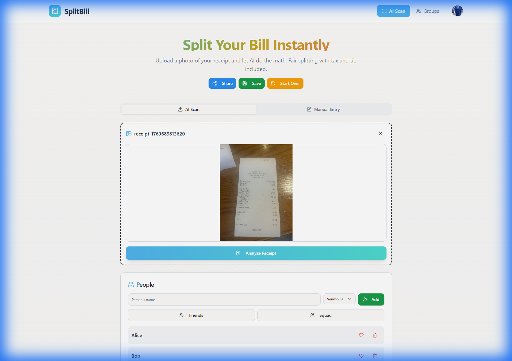
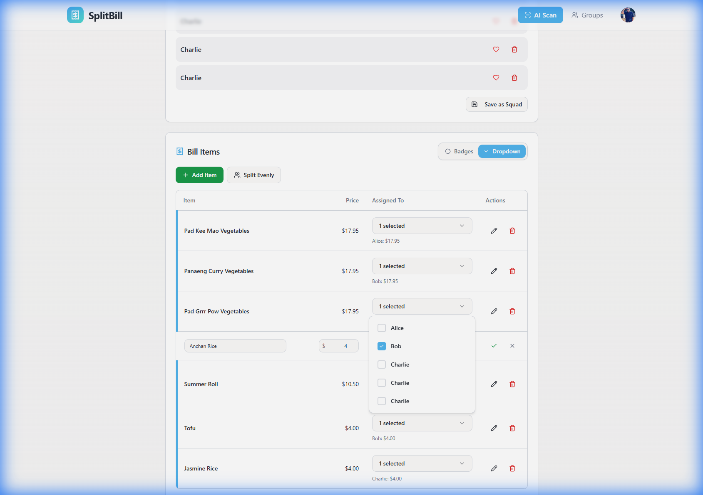
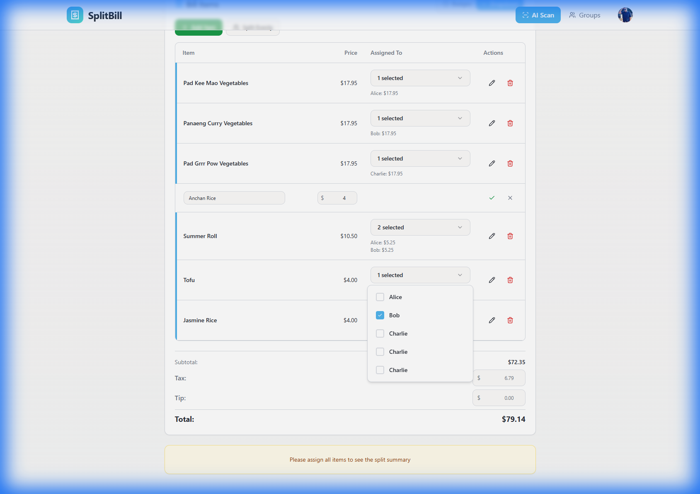

# Bill-Split Application Analysis

**Date:** November 20, 2025  
**Test Bill:** Thai Restaurant Receipt (IMG_5828.jpg)  
**Test Users:** Alice, Bob, Charlie

---

## Executive Summary

Bill-Split is an AI-powered bill splitting application that uses Google Gemini 2.5 Flash-Lite to analyze receipt images and fairly distribute costs among friends. The app supports both web and mobile platforms (iOS/Android via Capacitor) and integrates with Venmo for payment requests.

**Key Strengths:**
- ✅ Accurate AI receipt scanning and item extraction
- ✅ Flexible item assignment with two modes (Badges & Dropdown)
- ✅ Proportional tax and tip distribution
- ✅ Clean, modern UI with responsive design
- ✅ Firebase integration for authentication and data storage

**Key Areas for Improvement:**
- ⚠️ UX friction in item assignment workflow
- ⚠️ Missing final split summary visibility
- ⚠️ Limited error handling and user feedback
- ⚠️ No manual bill editing after AI scan
- ⚠️ Incomplete Venmo integration testing

---

## Application Flow & Features

### 1. **AI Receipt Scanning**

**What It Does:**
- Users upload a receipt image via file picker
- AI analyzes the image and extracts:
  - Individual items with prices
  - Subtotal
  - Tax amount
  - Total
  - Tip (optional, can be added manually)

**Test Results:**
The AI successfully extracted from the Thai restaurant receipt:
- ✅ Pad Kee Mao Vegetables: $17.95
- ✅ Panaeng Curry Vegetables: $17.95
- ✅ Pad Grrr Pow Vegetables: $17.95
- ✅ Anchan Rice: $4.00
- ✅ Summer Roll: $10.50
- ✅ Tofu: $4.00
- ✅ Jasmine Rice: $4.00
- ✅ Subtotal: $72.35
- ✅ Tax: $6.79
- ✅ Total: $79.14

**Observations:**
- Processing time was reasonable (~5-10 seconds)
- Accuracy was excellent for this receipt
- No obvious extraction errors

### 2. **People Management**

**What It Does:**
- Simple input field to add people to the bill
- Each person can have an optional Venmo ID
- People are displayed as badges/chips

**Test Results:**
- ✅ Successfully added Alice, Bob, and Charlie
- ✅ Simple, intuitive interface
- ✅ No Venmo IDs required for testing

**Issues Identified:**
- ❌ No way to edit a person's name after adding
- ❌ No way to add Venmo ID after initial creation
- ❌ Deleting a person doesn't show confirmation or warn about assigned items

### 3. **Item Assignment System**

**What It Does:**
The app offers two assignment modes:

#### **Badges Mode**
- Click on person badges next to each item
- Appears to assign items to only one person at a time
- Last clicked person "owns" the item

#### **Dropdown Mode**
- Multi-select dropdown for each item
- Allows splitting items between multiple people
- Automatically calculates split amounts (e.g., $10.50 → $5.25 each for 2 people)

**Test Results:**
- ✅ Assigned "Pad Kee Mao Vegetables" to Alice
- ✅ Assigned "Panaeng Curry Vegetables" to Bob
- ✅ Assigned "Pad Grrr Pow Vegetables" to Charlie
- ✅ Split "Summer Roll" between Alice and Bob ($5.25 each)
- ✅ Assigned "Tofu" to Bob
- ✅ Assigned "Jasmine Rice" to Charlie
- ⚠️ "Anchan Rice" remained unassigned (browser automation difficulty)

**Issues Identified:**
- ❌ **Badges mode is confusing** - clicking multiple badges doesn't clearly indicate splitting
- ❌ **Mode switching isn't obvious** - users may not discover Dropdown mode
- ❌ **No visual feedback** when switching modes
- ❌ **Unassigned items aren't highlighted** - easy to miss items
- ❌ **Can't see split summary until ALL items assigned** - creates friction

### 4. **Bill Split Summary**

**What It Does:**
- Shows each person's total amount owed
- Includes proportional tax and tip distribution
- Only appears when all items are assigned

**Test Results:**
- ⚠️ Could not view final summary due to one unassigned item
- ⚠️ Message displayed: "Please assign all items to see the split summary"

**Issues Identified:**
- ❌ **All-or-nothing approach is frustrating** - should show partial summary
- ❌ **No indication of which items are unassigned**
- ❌ **No progress indicator** (e.g., "6 of 7 items assigned")

### 5. **Venmo Integration**

**What It Does:**
- Generates Venmo payment requests with itemized descriptions
- Users can charge friends directly through Venmo

**Test Results:**
- ⚠️ Did not test (as requested, to avoid actual Venmo requests)
- 📝 Feature exists but needs validation

---

## Technical Architecture

### **Frontend Stack**
- **Framework:** React 18 with TypeScript
- **Build Tool:** Vite 5
- **Routing:** React Router v6
- **UI Library:** shadcn/ui (Radix UI components)
- **Styling:** TailwindCSS
- **State Management:** React Context (AuthContext, BillSessionContext)
- **Data Fetching:** TanStack Query (React Query)
- **Mobile:** Capacitor 7 (iOS & Android)

### **Backend & Services**
- **Authentication:** Firebase Authentication (Google OAuth)
- **Database:** Firebase Firestore
- **Functions:** Firebase Cloud Functions
- **AI:** Google Gemini 2.5 Flash-Lite API
- **Image Processing:** browser-image-compression (60-70% faster processing)

### **Key Files & Structure**

```
src/
├── pages/
│   ├── AIScanView.tsx          # Main AI scanning page
│   ├── GroupEventView.tsx      # Groups listing
│   ├── GroupDetailView.tsx     # Group details
│   ├── CollaborativeSessionView.tsx  # Shared sessions
│   ├── SettingsView.tsx        # User settings
│   └── Auth.tsx                # Authentication
├── components/
│   ├── bill/
│   │   ├── AssignmentModeToggle.tsx  # Badges/Dropdown toggle
│   │   ├── BillItemCard.tsx          # Individual item card
│   │   ├── BillItems.tsx             # Items list
│   │   ├── BillSummary.tsx           # Split summary
│   │   └── ItemFormFields.tsx        # Item input fields
│   ├── people/                 # People management
│   ├── venmo/                  # Venmo integration
│   ├── groups/                 # Group features
│   └── sessions/               # Collaborative sessions
├── contexts/
│   ├── AuthContext.tsx         # Auth state
│   └── BillSessionContext.tsx  # Bill state
└── services/                   # API services
```

### **Deployment**
- **Web:** Vercel (continuous deployment)
- **iOS:** Xcode build → App Store
- **Android:** Android Studio → Play Store

---

## User Experience Issues

### **Critical Issues** 🔴

1. **Split Summary Blocked by Unassigned Items**
   - Users can't see their progress until 100% complete
   - No way to know which items are missing
   - Creates frustration and confusion

2. **Assignment Mode Confusion**
   - Badges mode behavior is unclear (single vs. multi-assign)
   - Users may not discover Dropdown mode
   - No tooltips or help text explaining the difference

3. **No Edit Capabilities After AI Scan**
   - Can't fix AI extraction errors
   - Can't add missing items
   - Can't adjust prices

### **High Priority Issues** 🟡

4. **Missing Progress Indicators**
   - No "X of Y items assigned" counter
   - No visual highlighting of unassigned items
   - No completion percentage

5. **Limited People Management**
   - Can't edit person details after creation
   - No confirmation when deleting people
   - No Venmo ID management

6. **No Error Recovery**
   - If AI scan fails, no fallback to manual entry
   - No retry mechanism
   - No error messages with actionable guidance

### **Medium Priority Issues** 🟢

7. **Tip Management**
   - Tip field is easy to overlook
   - No percentage calculator (e.g., "15%", "18%", "20%" buttons)
   - No validation for reasonable tip amounts

8. **Mobile Responsiveness**
   - Dropdown mode may be difficult on small screens
   - Long item names may overflow
   - Badge layout could be optimized for mobile

---

## Recommended Improvements

### **Phase 1: Quick Wins** (1-2 weeks)

#### 1.1 Show Partial Split Summary
**Problem:** Users can't see progress until all items assigned  
**Solution:** Show summary for assigned items, with placeholder for unassigned

```typescript
// Show partial totals even with unassigned items
{assignedItems.length > 0 && (
  <div className="partial-summary">
    <h3>Current Split (Partial)</h3>
    <p className="text-muted-foreground">
      {assignedItems.length} of {totalItems} items assigned
    </p>
    {/* Show current totals */}
  </div>
)}
```

**Impact:** High - Immediate UX improvement  
**Effort:** Low - 2-4 hours

#### 1.2 Highlight Unassigned Items
**Problem:** Hard to see which items need assignment  
**Solution:** Add visual indicator (border, background color, icon)

```typescript
<BillItemCard
  item={item}
  isUnassigned={item.assignedTo.length === 0}
  className={item.assignedTo.length === 0 ? 'border-orange-500 border-2' : ''}
/>
```

**Impact:** High - Reduces user confusion  
**Effort:** Low - 1-2 hours

#### 1.3 Add Progress Counter
**Problem:** No visibility into completion status  
**Solution:** Add progress bar or counter

```typescript
<div className="progress-indicator">
  <Progress value={(assignedItems.length / totalItems) * 100} />
  <span>{assignedItems.length} / {totalItems} items assigned</span>
</div>
```

**Impact:** Medium - Better user feedback  
**Effort:** Low - 1-2 hours

#### 1.4 Improve Assignment Mode Toggle
**Problem:** Users don't understand the difference  
**Solution:** Add tooltips and better labels

```typescript
<TooltipProvider>
  <Tooltip>
    <TooltipTrigger>
      <Button variant={mode === 'badges' ? 'default' : 'outline'}>
        Badges (Single Person)
      </Button>
    </TooltipTrigger>
    <TooltipContent>
      Click badges to assign items to one person at a time
    </TooltipContent>
  </Tooltip>
</TooltipProvider>
```

**Impact:** Medium - Reduces confusion  
**Effort:** Low - 2-3 hours

#### 1.5 Add Tip Percentage Buttons
**Problem:** Manual tip calculation is tedious  
**Solution:** Quick percentage buttons

```typescript
<div className="tip-calculator">
  <Label>Tip</Label>
  <div className="flex gap-2 mb-2">
    <Button onClick={() => setTip(subtotal * 0.15)}>15%</Button>
    <Button onClick={() => setTip(subtotal * 0.18)}>18%</Button>
    <Button onClick={() => setTip(subtotal * 0.20)}>20%</Button>
  </div>
  <Input type="number" value={tip} onChange={...} />
</div>
```

**Impact:** Medium - Faster workflow  
**Effort:** Low - 2-3 hours

---

### **Phase 2: Core Improvements** (2-4 weeks)

#### 2.1 Manual Bill Editing
**Problem:** Can't fix AI errors or add missing items  
**Solution:** Add edit mode for bill items

**Features:**
- Edit item names and prices
- Add new items manually
- Delete incorrect items
- Adjust tax and subtotal

**Impact:** High - Critical for accuracy  
**Effort:** Medium - 8-12 hours

#### 2.2 Enhanced People Management
**Problem:** Can't edit people after creation  
**Solution:** Add edit/delete with confirmation

**Features:**
- Edit person name and Venmo ID
- Delete with confirmation dialog
- Show warning if person has assigned items
- Reassign items when deleting person

**Impact:** Medium - Better flexibility  
**Effort:** Medium - 6-8 hours

#### 2.3 Assignment Workflow Redesign
**Problem:** Two modes create confusion  
**Solution:** Unified assignment interface

**Proposed UX:**
- Single mode with clear multi-select
- Visual checkboxes or chips for each person
- Drag-and-drop support (optional)
- Bulk assignment (e.g., "Assign all to Alice")

**Impact:** High - Major UX improvement  
**Effort:** High - 12-16 hours

#### 2.4 Error Handling & Recovery
**Problem:** No fallback when AI fails  
**Solution:** Graceful error handling

**Features:**
- Retry button for failed AI scans
- Fallback to manual entry
- Clear error messages
- Loading states with progress

**Impact:** High - Better reliability  
**Effort:** Medium - 6-8 hours

#### 2.5 Item Templates & Presets
**Problem:** Repetitive manual entry for common items  
**Solution:** Save and reuse common items

**Features:**
- Save frequently used items (e.g., "Coffee - $5.00")
- Restaurant-specific templates
- Quick add from templates

**Impact:** Medium - Faster manual entry  
**Effort:** Medium - 8-10 hours

---

### **Phase 3: Advanced Features** (4-8 weeks)

#### 3.1 Smart Item Suggestions
**Problem:** AI may miss items or make errors  
**Solution:** AI-powered suggestions and corrections

**Features:**
- Suggest missing items based on restaurant type
- Flag unusual prices (e.g., $100 coffee)
- Auto-categorize items (appetizers, entrees, drinks)

**Impact:** Medium - Better accuracy  
**Effort:** High - 16-20 hours

#### 3.2 Split History & Analytics
**Problem:** No record of past bills  
**Solution:** Bill history and insights

**Features:**
- View past bills and splits
- See who you split with most often
- Track spending over time
- Export to CSV

**Impact:** Medium - Added value  
**Effort:** High - 20-24 hours

#### 3.3 Multi-Currency Support
**Problem:** Only supports USD  
**Solution:** International currency support

**Features:**
- Detect currency from receipt
- Convert between currencies
- Support for €, £, ¥, etc.

**Impact:** Low - Niche use case  
**Effort:** Medium - 10-12 hours

#### 3.4 Receipt Storage & OCR Improvements
**Problem:** Can't re-scan or view original receipt  
**Solution:** Store receipts and improve OCR

**Features:**
- Save original receipt image
- View receipt alongside bill
- Re-scan with different AI settings
- Manual OCR corrections

**Impact:** Medium - Better accuracy  
**Effort:** High - 16-20 hours

#### 3.5 Social Features
**Problem:** Limited collaboration  
**Solution:** Enhanced group features

**Features:**
- Group chat for bill discussion
- Vote on item assignments
- Request payment reminders
- Payment status tracking

**Impact:** Medium - Better collaboration  
**Effort:** Very High - 30+ hours

---

## Testing Recommendations

### **Unit Tests Needed**
- [ ] Bill calculation logic (tax/tip distribution)
- [ ] Item assignment logic (single vs. split)
- [ ] People management (add/edit/delete)
- [ ] Currency formatting and validation

### **Integration Tests Needed**
- [ ] AI scan → item extraction → assignment flow
- [ ] Firebase auth → user profile → bill creation
- [ ] Venmo integration (mock API)
- [ ] Group collaboration features

### **E2E Tests Needed**
- [ ] Complete bill splitting workflow
- [ ] Mobile app deep linking
- [ ] Offline functionality
- [ ] Error recovery scenarios

### **Manual Testing Checklist**
- [ ] Test with various receipt types (restaurants, grocery, bars)
- [ ] Test with different image qualities (blurry, dark, angled)
- [ ] Test on different devices (iOS, Android, web)
- [ ] Test with edge cases (0 items, 100 items, $0.00 items)

---

## Performance Optimization Opportunities

1. **Image Compression**
   - Already implemented (60-70% faster)
   - Consider WebP format for better compression

2. **Lazy Loading**
   - Load bill items progressively
   - Defer non-critical UI components

3. **Caching**
   - Cache AI scan results
   - Cache user profiles and friends list
   - Use React Query for automatic caching

4. **Code Splitting**
   - Split routes into separate bundles
   - Lazy load heavy components (charts, analytics)

5. **Database Optimization**
   - Index Firestore queries
   - Batch reads/writes
   - Use real-time listeners sparingly

---

## Security Considerations

### **Current Security Measures**
- ✅ Firebase Authentication (Google OAuth)
- ✅ Firestore security rules
- ✅ HTTPS for all requests
- ✅ API keys stored in environment variables

### **Recommended Improvements**
- [ ] Rate limiting on AI API calls
- [ ] Input validation on all user inputs
- [ ] Sanitize receipt image uploads
- [ ] Implement CSRF protection
- [ ] Add request signing for Venmo API
- [ ] Audit logging for sensitive operations

---

## Accessibility Improvements

### **Current Issues**
- ❌ No keyboard navigation for item assignment
- ❌ Missing ARIA labels on interactive elements
- ❌ Color contrast may not meet WCAG AA standards
- ❌ No screen reader support for bill summary

### **Recommended Fixes**
- [ ] Add keyboard shortcuts (e.g., Tab, Enter, Space)
- [ ] Add ARIA labels and roles
- [ ] Ensure color contrast meets WCAG AA (4.5:1)
- [ ] Add screen reader announcements for state changes
- [ ] Support high contrast mode
- [ ] Add focus indicators for all interactive elements

---

## Conclusion

Bill-Split is a well-architected application with a solid foundation. The AI scanning feature works accurately, and the core bill splitting logic is sound. However, there are significant UX friction points that prevent the app from reaching its full potential.

### **Immediate Priorities:**
1. ✅ Show partial split summary (don't block on 100% completion)
2. ✅ Highlight unassigned items visually
3. ✅ Add progress indicators
4. ✅ Improve assignment mode clarity
5. ✅ Add tip percentage quick buttons

### **Next Steps:**
1. Implement Phase 1 quick wins (1-2 weeks)
2. User testing with real receipts and feedback
3. Prioritize Phase 2 based on user feedback
4. Build comprehensive test suite
5. Plan Phase 3 advanced features

The app has strong potential to become a go-to solution for bill splitting. With focused improvements on UX friction points and better error handling, it can provide a seamless experience for users.

---

## Appendix: Test Screenshots


*People management interface showing Alice, Bob, and Charlie added to the bill*


*Bill items extracted by AI with assignment dropdowns*


*Bottom section showing the message to assign all items before viewing split summary*

---

**Analysis Completed:** November 20, 2025  
**Next Review:** After Phase 1 implementation
